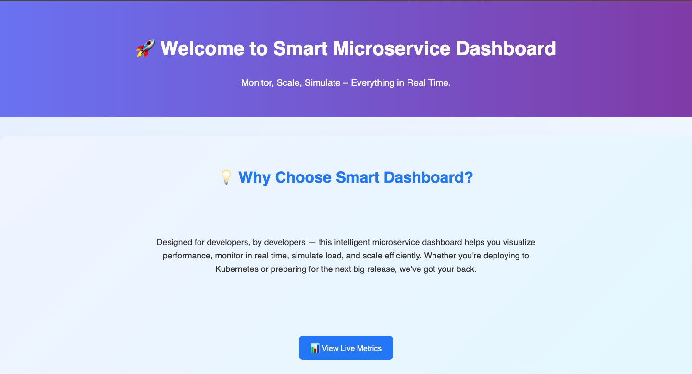
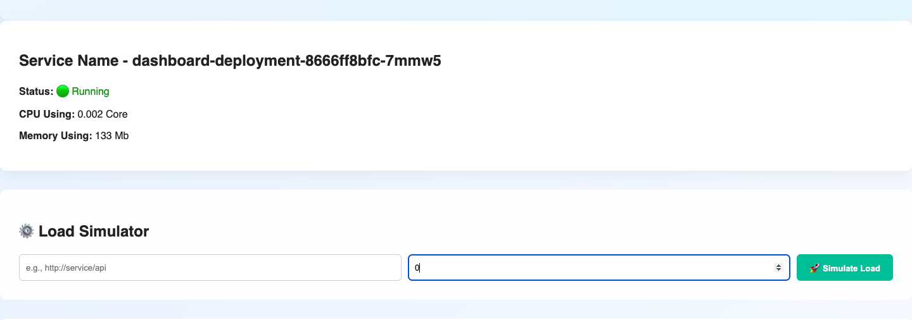
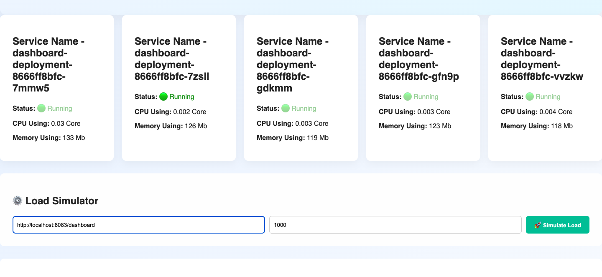
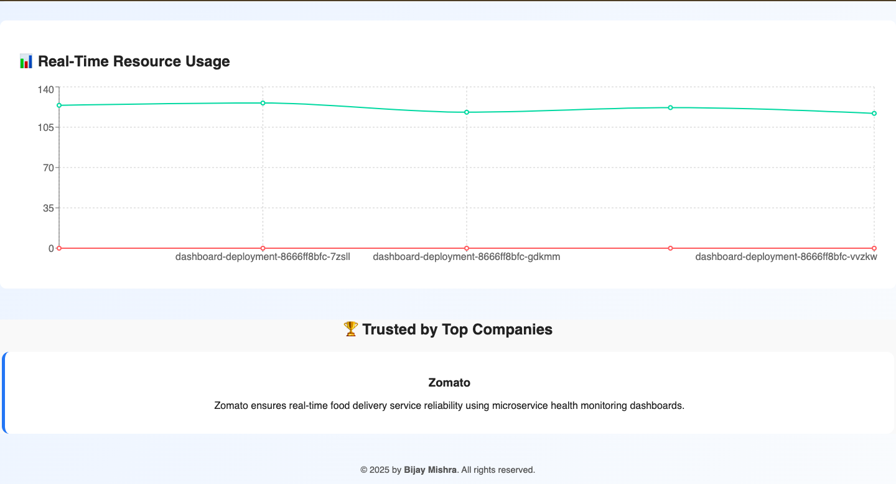
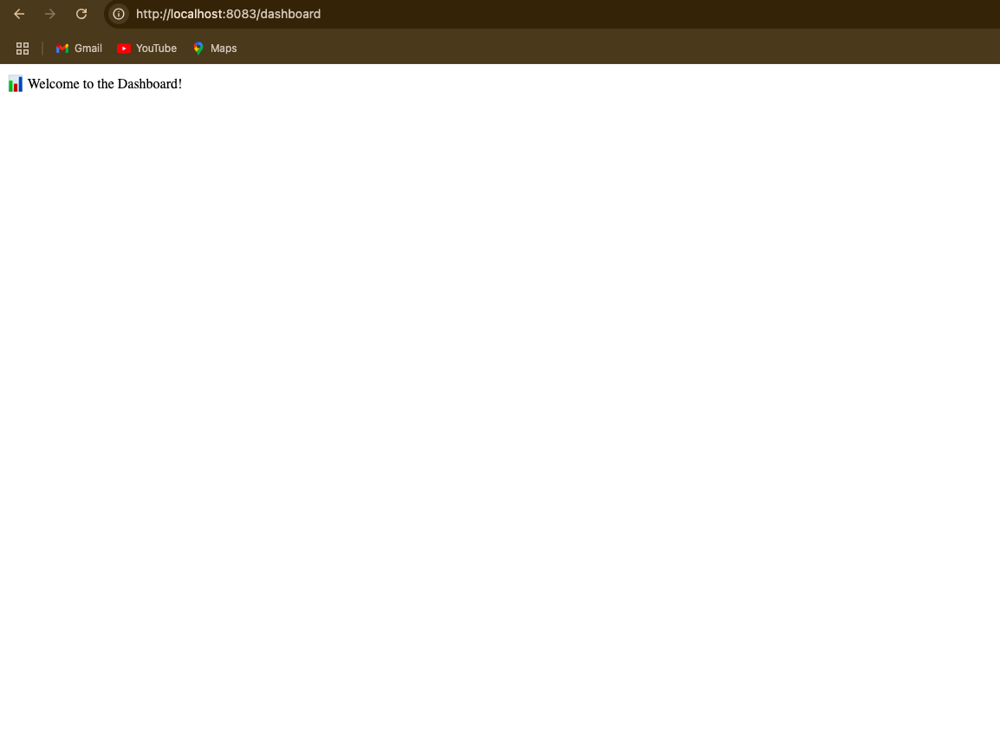

# 🚀 Smart Load Balancer for Microservices

An intelligent, containerized microservices-based system that utilizes **Kubernetes HPA** to dynamically distribute traffic based on **real-time CPU usage**, while offering **live monitoring dashboards** using **Prometheus** and **Grafana**.

---

## 🛠️ Tech Stack

| Layer            | Technology                          |
|------------------|-------------------------------------|
| Frontend         | React.js + Recharts                 |
| Backend          | Spring Boot (Java)                  |
| Containerization | Docker                              |
| Orchestration    | Kubernetes (kind + Docker Desktop)  |
| Monitoring       | Prometheus + Grafana                |
| Load Balancing   | Kubernetes HPA (CPU > 50%)          |

---

## 📁 Project Structure

```
smart-load-balancer/
├── client/        # React frontend
├── backend/       # Spring Boot backend
├── services/      # Additional microservices (e.g., dashboard)
├── k8s/           # Kubernetes YAMLs (Deployment, Services, HPA, etc.)
└── README.md
```

---

## 📸 Project Previews

<p align="center">
  
  <br/>
  <i>React Dashboard showing microservices metrics</i>
</p>

<p align="center">
  
    <br/>
  <i>Microservices initital Running Visual</i>
</p>

<p align="center">
  
    <br/>
  <i>Microservices After Request send showing Scaled up running Visual</i>
</p>

<p align="center">
  
  <br/>
  <i>Real-time CPU/memory data via Charts</i>
</p>

<p align="center">
  
  <br/>
  <i>Microservices interactions and Deployed</i>
</p>

---


## ⚙️ How It Works

1. **Kubernetes** orchestrates all services and manages scaling.
2. **Horizontal Pod Autoscaler (HPA)** dynamically scales pods based on CPU thresholds (>75%).
3. **Docker** containers wrap each service for consistency.
4. **Prometheus** scrapes CPU/memory metrics from pods.
5. **Grafana** visualizes real-time data using customizable dashboards.
6. **React frontend** displays a live dashboard with charts (via Recharts).

---

## 🚀 Running the Project Locally

### 1️⃣ Clone the Repository

```bash

1️⃣ Clone the Repository
git clone https://github.com/bijaymsra/smart-load-balancer.git
cd smart-load-balancer

2️⃣ Start Kubernetes Cluster (via kind)
Make sure Docker Desktop is running and Kubernetes is enabled.
kind create cluster --name smart-lb-cluster

3️⃣ Deploy Services and Infrastructure
kubectl apply -f k8s/

This includes:
✅ Spring Boot backend  
✅ React frontend  
✅ Dashboard microservice  
✅ MySQL database  
✅ HPA (Horizontal Pod Autoscaler) configuration  

4️⃣ Set Up the Database (MySQL)
- MySQL service is automatically deployed via Kubernetes.
- Spring Boot microservices are configured to connect using:
  `spring.datasource.url=jdbc:mysql://mysql-service:3306/<your-db-name>`

- Default credentials (can be found or overridden via Kubernetes Secrets):
  - **Username**: `root`
  - **Password**: `password`

💡 To inspect or access MySQL directly:
kubectl get svc mysql-service
kubectl exec -it <mysql-pod-name> -- mysql -u root -p

5️⃣ Access the Services

📌 For Microservices Port Forwarding:
kubectl port-forward service/dashboard-service 8083:80

| Service          | URL                                 |
|------------------|-------------------------------------|
| React Client     | http://localhost:3000               |
| Backend APIs     | http://<backend-service-ip>:<port>  |
| Microservices    | http://localhost:8083/dashboard     |
| MySQL (internal) | mysql://mysql-service:3306          |


```

---

## 🔧 Build Docker Images

From each service directory, run:

```bash
docker build -t service-name:latest .
```

---

## 📌 Features

- ✅ Kubernetes-powered autoscaling  
- ✅ Real-time traffic distribution based on CPU usage  
- ✅ React dashboard with dynamic charts  
- ✅ Microservices fully containerized  
- ✅ Cloud deployment-ready

  ---

## ✍️ Author

**Bijay M S R A**  
[GitHub Profile](https://github.com/bijaymsra)

---

## 📜 License

This project is licensed under the **MIT License**.

---

## 📸 Optional Additions

Want to improve this README further? Consider adding:

- 🧱 **Architecture Diagram** (PNG/SVG)
- 🖼️ **Screenshots** of the frontend & Grafana dashboard
- 🎥 **Project Demo Video** (YouTube/Loom)
- ☁️ **Deployment Steps** for GCP / AWS / Azure
- 🤝 **Contribution Guidelines**

## 💡 Need Help?

Let me know if you want help generating:

- 🧱 A diagram of your architecture  
- 📄 YAML templates for Prometheus/Grafana setup  
- ⚙️ GitHub Actions CI/CD for auto-deployments  

✨ Happy to help polish this project even more!
